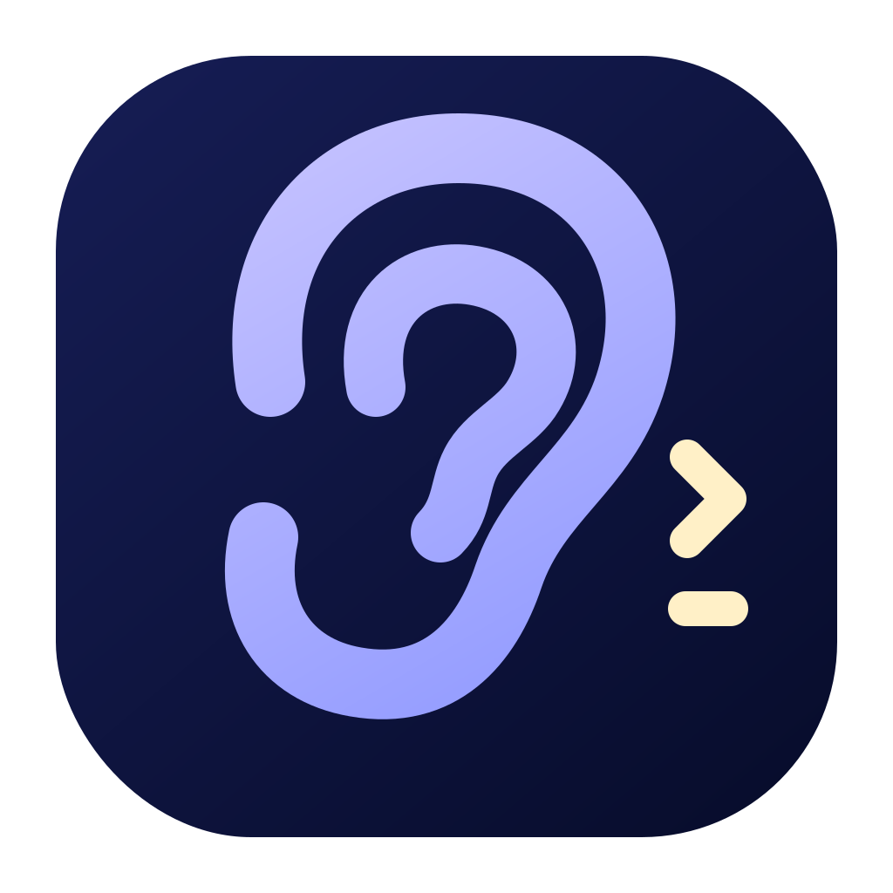

<p align="center">
  
</p>

# Hey Codex

A small macOS menu-bar app that starts Codex dictation or Voice Chat when you say “Hey Codex” or “Hey Jarvis.”

[](https://github.com/lazynoc/hey-codex/actions/workflows/ci.yml)
[](LICENSE)

Hey Codex is an independent, unofficial community project. It is not affiliated with or endorsed by OpenAI.

## Local by design

- On-device wake-phrase recognition
- No Hey Codex server, account, API key, or analytics
- No third-party runtime dependencies
- Codex remains responsible for recording, transcription, insertion, and its recovery history

Hey Codex does not transcribe prompts. It writes transcript text to the clipboard only when you explicitly click **Copy**. The manual update check contacts GitHub but sends no audio or prompt text.

## Install

Download [Hey Codex 1.0.0](https://github.com/lazynoc/hey-codex/releases/latest/download/Hey-Codex-1.0.0.dmg), open the DMG, and drag **Hey Codex** to **Applications**.

The public app is Developer ID-signed, notarised by Apple, and requires:

- An Apple-silicon Mac running macOS 14 or newer
- The Codex desktop app
- A **Toggle dictation hotkey** configured in Codex under **Settings > Voice**
- A **Voice chat hotkey** in the same Codex settings if you want to use “Hey Jarvis”
- Microphone, Speech Recognition, Accessibility, and Automation permissions

First launch opens a four-step Setup Guide that checks each permission, detects the Codex shortcuts, and lets you test both wake phrases. After setup, Hey Codex runs from the menu bar. Reopen the guide anytime from **Settings > General > Help**.

## Use

1. Keep Codex running and place the cursor where you want the text.
2. Say **“Hey Codex.”**
3. Wait for Codex’s desktop dictation indicator, then speak normally.
4. Press **Control+Option+D** to stop, or use **Stop Dictation** in the menu.

Hey Codex restores the original app and cursor so Codex can insert the finished transcript in the right place. **Start Dictation** in the menu performs the same flow without the wake phrase.

### Voice chat

Say **"Hey Jarvis"** to toggle Codex's realtime voice chat (it follows the **Voice chat hotkey** set in Codex Settings > Voice). While Voice Chat is open, Hey Codex ignores the dictation phrase and listens only for "Hey Jarvis" so you can end the chat hands-free. Closing Voice Chat directly in Codex also returns Hey Codex to normal listening automatically. The phrase is editable and can be turned off in **Settings > General > Voice chat**. **Voice Chat** in the menu performs the same toggle.

## What you can control

- Wake phrases (dictation and voice chat), wake sensitivity, and microphone
- Listening pause for 30 minutes or one hour
- Automatic safety stop after 10, 20, or 30 minutes
- Optional stop after 10, 20, or 30 seconds of silence
- Wake and completion sounds with Off, Low, Medium, and System-level choices
- Start at login, System/Light/Dark theme, and Small/Medium/Large interface size
- Three recent dictations in the menu, each expandable with an explicit **Copy** button
- **View All** for the entries currently available in Codex’s local history
- Total dictated word count
- Manual update checking against stable GitHub releases; installing an update remains manual

## Privacy

Wake recognition sets Apple Speech’s `requiresOnDeviceRecognition`. Hey Codex tries the current locale and then on-device US/UK English fallbacks; if none is available, it refuses to listen rather than sending wake audio to a server.

Hey Codex does not save audio or duplicate prompt history. It reads Codex’s local transcription-history file to show recent entries and stores only the word-count aggregate under `~/Library/Application Support/Hey Codex/`.

macOS shows its orange microphone privacy indicator while wake listening uses the microphone. Turn listening off to release it; the indicator may remain if another app is also using the microphone. [Apple documents this indicator](https://support.apple.com/guide/mac-help/mchlp1446/mac).

## Known limits

- Codex must be running.
- Continuous wake listening keeps the microphone active.
- Hey Codex starts and stops Codex’s native dictation; Codex owns recording, transcription, insertion, and recovery history.
- Apple Speech sessions rotate periodically. Hey Codex overlaps them briefly to minimise missed wake phrases during rotation.

## Build the latest source

Source builds require Xcode 16.3 or newer, or Swift 6.1-compatible Command Line Tools:

```bash
curl -fsSL https://raw.githubusercontent.com/lazynoc/hey-codex/main/scripts/install-latest.sh | zsh
```

This builds in a temporary directory and installs to `~/Applications/Hey Codex.app` without creating or modifying a Git checkout. Run the same command to update. Settings are preserved; macOS permissions remain only when the signing identity stays stable.

For a completely fresh onboarding test:

```bash
curl -fsSL https://raw.githubusercontent.com/lazynoc/hey-codex/main/scripts/install-latest.sh | zsh -s -- --fresh
```

## Clean uninstall

Remove the app while keeping settings and Codex data:

```bash
curl -fsSL https://raw.githubusercontent.com/lazynoc/hey-codex/main/scripts/uninstall.sh | zsh
```

Remove Hey Codex settings, saved stats, and permissions as well:

```bash
curl -fsSL https://raw.githubusercontent.com/lazynoc/hey-codex/main/scripts/uninstall.sh | zsh -s -- --purge
```

Preview the full reset without changing anything:

```bash
curl -fsSL https://raw.githubusercontent.com/lazynoc/hey-codex/main/scripts/uninstall.sh | zsh -s -- --dry-run --purge
```

The uninstaller handles copies in `/Applications` and `~/Applications` while keeping Codex, `~/.codex/keybindings.json`, and Codex transcription history.

## Development

```bash
swift test
./scripts/build-app.sh
```

- [Install and troubleshooting](docs/INSTALL.md)
- [How Hey Codex works](docs/HOW-IT-WORKS.md)
- [Release packaging](docs/RELEASING.md)
- [Contributing](CONTRIBUTING.md)
- [Security](SECURITY.md)

## License

MIT
